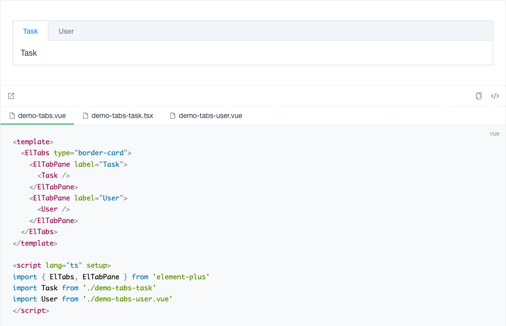
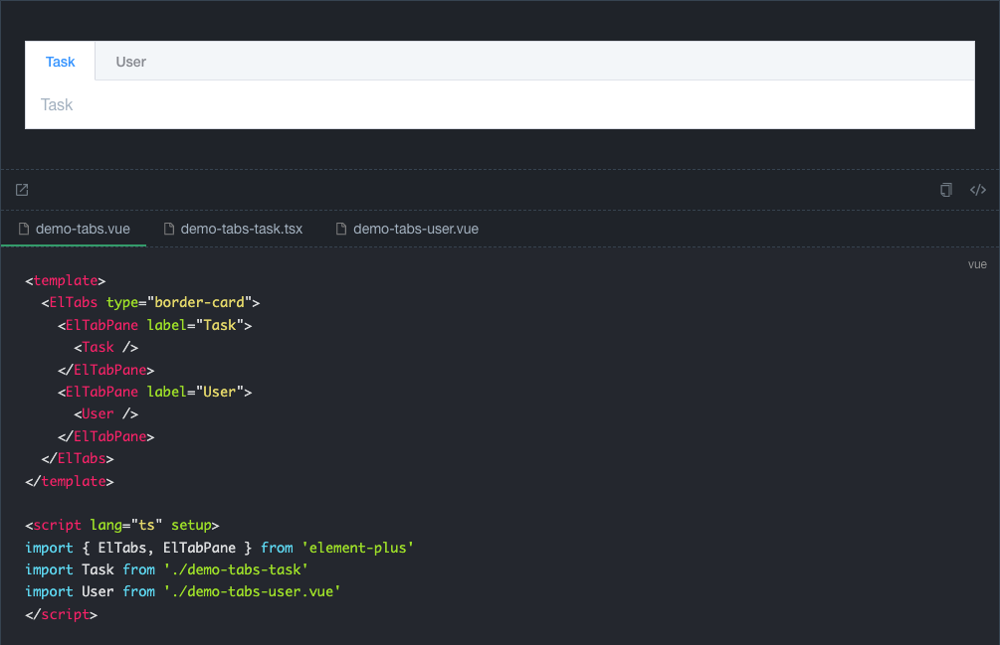

# vmi

Vmi 是一个用于组件开发场景的 VuePress 的插件集合。尽量通过插件能有相似 [dumi](https://d.umijs.org/zh-CN) 的 Demo 体验，又能保持 VuePress 强大的文档编写能力。

## 特性

- 支持页面映射，自定义组织组件文档。

- 强大的 Demo 演示能力，支持 Iframe 等多种模式。

## 示例

亮色模式

暗黑模式

## Issue

If you have a better suggestion, please [create an issue](https://github.com/bfehub/vmi/issues)

## License

The code is released under [the MIT license](https://github.com/bfehub/vmi/blob/master/LICENSE)
